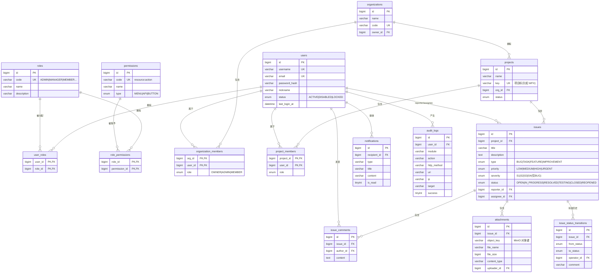

# WorkFlowX ER 模型（初稿）

> 阶段: Phase 1 任务 1-4 ｜ 状态: 初稿（随 Phase 2–10 演进，变更须走 Flyway 迁移并同步本文件）
> 规则: Master Prompt §8 ｜ 关联 ADR-003（RBAC）

## 设计约定

1. 命名统一 snake_case；表名复数
2. 主键 `id BIGINT UNSIGNED AUTO_INCREMENT`
3. 时间字段统一 `created_at` / `updated_at`（DATETIME(3)，默认当前时间，updated_at 随更新自动刷新）
4. 状态字段统一 ENUM，取值见数据字典
5. 关联表使用复合主键 + 外键（ON DELETE CASCADE），业务表外键按需评估
6. 字符集 utf8mb4 / utf8mb4_0900_ai_ci

## ER 图

> 实线标注的 5 张表（users / roles / permissions / user_roles / role_permissions）已在 V1 落地；
> 其余为 Phase 2–10 的设计稿（DDL 归属见 migration-plan.md）。

## 关键关系说明

| 关系 | 基数 | 说明 |
|---|---|---|
| users ↔ roles | 多对多 | user_roles 关联表（V1） |
| roles ↔ permissions | 多对多 | role_permissions 关联表（V1） |
| organizations ↔ projects | 一对多 | 项目归属组织 |
| projects ↔ issues | 一对多 | Issue 必属于项目 |
| users ↔ issues | 一对多×2 | reporter 与 assignee 两个引用（不做外键，索引查询） |
| issues ↔ 状态历史 | 一对多 | issue_status_transitions 支撑状态机审计（Phase 7） |

## 与 Master Prompt 的一致性核对

- §14 Issue 类型/优先级/Severity/状态枚举 → issues 表 ENUM（见数据字典）
- §7 RBAC 五层结构 → users/roles/permissions + 两张关联表（V1 已落地）
- §8 避免大 JSON 字段、避免单表堆业务 → 全部实体关系化设计
